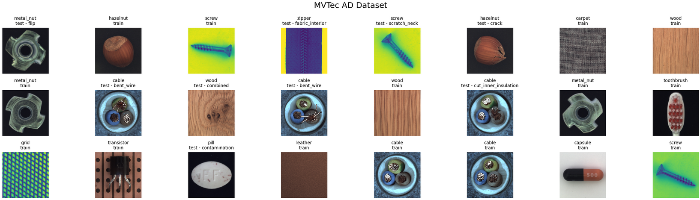

# AnomalyFTP

## Visualization
These are the results obtained from:

**1) GLASS:**


**2) SimpleNet**


---

## **Unsupervised Anomaly Detection for Industrial Visual Inspection: Implementation and Evaluation**

AnomalyFTP is an open-source implementation focused on unsupervised anomaly detection for industrial visual inspection tasks. The repository provides tools and code for detecting visual anomalies in industrial settings, where abnormal samples are rare and defects can range from subtle scratches to significant structural issues.

---

## Key Features

- Implements state-of-the-art unsupervised anomaly detection methods tailored for industrial images.
- Designed for industrial inspection scenarios where labeled anomalies are scarce.
- Supports evaluation and benchmarking on standard datasets.

---
## DataSet 
The MVTec Anomaly Detection () dataset is a widely used benchmark for evaluating unsupervised anomaly detection methods, particularly in the context of industrial visual inspection. It is specifically designed to reflect real-world manufacturing scenarios, where defective samples are scarce, and models are typically trained only on normal (defect-free) images.


---
## Methodology

The repository explores advanced anomaly detection techniques, including models inspired by recent research **GLASS** and **SimpleNet**.

### GLASS: Global and Local Anomaly co-Synthesis Strategy

**GLASS** (Global and Local Anomaly co-Synthesis Strategy) is a unified framework for synthesizing a broader and more controllable range of anomalies at both the feature and image levels. It consists of:

- **Global Anomaly Synthesis (GAS):** Synthesizes weak, near-in-distribution anomalies at the feature level using Gaussian noise guided by gradient ascent and truncated projection. This approach enhances the detection of subtle defects that are close to normal samples.
- **Local Anomaly Synthesis (LAS):** Generates strong, far-from-distribution anomalies at the image level by overlaying textures, providing a diverse set of synthetic anomalies.

GLASS achieves state-of-the-art results on major industrial benchmarks such as MVTec AD (detection AUROC of 99.9%), VisA, and MPDD, and it excels in weak defect detection. Its effectiveness and efficiency have been validated in real-world industrial applications[1][3][4][5].

### SimpleNet

**SimpleNet** is a lightweight and application-friendly network for image anomaly detection and localization. It includes:

- A pre-trained feature extractor for local feature extraction.
- A shallow feature adapter for domain adaptation.
- An anomaly feature generator that injects Gaussian noise during training.
- A binary anomaly discriminator for distinguishing normal and anomalous features.

SimpleNet achieves high accuracy and fast inference, making it suitable for deployment in industrial environments.

---


---

## Getting Started

1. **Clone the repository:**

```bash
git clone https://github.com/nabayansaha/AnomalyFTP.git
cd AnomalyFTP
```

2. **Install dependencies:**
   - Ensure you have Python 3.x and pip installed.
   - Install required packages (see requirements.txt if provided).

3. **Prepare your data:**
   - Organize your industrial inspection images as described in the documentation.

4. **Run the code:**
   - Follow the usage instructions in the repository to train and evaluate anomaly detection models.

---

## Results

1. **GLASS**:
   
| Category    | I-AUROC (%) | P-AUROC (%) |
|-------------|-------------|-------------|
| Bottle      | 99.60       | 83.76       |
| Cable       | 87.95       | 71.55       |
| Capsule     | 94.34       | 63.60       |
| Carpet      | 93.24       | 93.51       |
| Grid        | 97.24       | 88.02       |
| Hazelnut    | 94.61       | 73.80       |
| Leather     | 99.80       | 97.50       |
| Metal Nut   | 99.56       | 70.58       |
| Pill        | 91.49       | 62.11       |
| Screw       | 86.62       | 68.41       |
| Tile        | 100.00      | 87.81       |
| Toothbrush  | 87.50       | 90.57       |
| Transistor  | 86.50       | 44.69       |
| Wood        | 98.51       | 83.10       |
| Zipper      | 99.89       | 81.96       |
| **Average** | **94.91**   | **77.89**   | 

2. **SimpleNet**:

| Category    | I-AUROC (%) | P-AUROC (%) |
|-------------|-------------|-------------|
| Bottle      | 98.49       | 82.75       |
| Cable       | 88.08       | 79.62       |
| Capsule     | 90.03       | 95.23       |
| Carpet      | 93.86       | 75.40       |
| Grid        | 92.94       | 87.87       |
| Hazelnut    | 60.04       | 68.99       |
| Leather     | 84.14       | 87.19       |
| Metal Nut   | 71.36       | 89.96       |
| Pill        | 71.09       | 86.19       |
| Screw       | 69.34       | 76.93       |
| Tile        | 78.86       | 67.79       |
| Toothbrush  | 80.83       | 85.73       |
| Transistor  | 77.08       | 79.08       |
| Wood        | 92.98       | 76.82       |
| Zipper      | 98.53       | 92.17       |
| **Average** | **83.66**   | **81.99**   |

---

## License

This project is released under the Apache 

---

## References

- [SimpleNet: A Simple Network for Image Anomaly Detection and Localization]

---

For more details, usage instructions, and contribution guidelines, please refer to the repository documentation.
