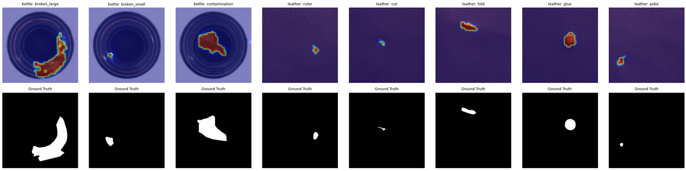
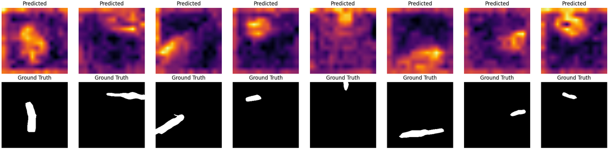

# AnomalyFTP

## Results
These are the results obtained from:
**1) GLASS:**

**2) SimpleNet**


---

**Unsupervised Anomaly Detection for Industrial Visual Inspection: Implementation and Evaluation**

AnomalyFTP is an open-source implementation focused on unsupervised anomaly detection for industrial visual inspection tasks. The repository provides tools and code for detecting visual anomalies in industrial settings, where abnormal samples are rare and defects can range from subtle scratches to significant structural issues.

---

## Key Features

- Implements state-of-the-art unsupervised anomaly detection methods tailored for industrial images.
- Designed for industrial inspection scenarios where labeled anomalies are scarce.
- Supports evaluation and benchmarking on standard datasets.

---

## Methodology

The repository explores advanced anomaly detection techniques, including models inspired by recent research such as **SimpleNet**.

**SimpleNet** is a simple and application-friendly network designed for image anomaly detection and localization. It consists of:

- A pre-trained Feature Extractor to obtain local features.
- A shallow Feature Adapter for domain adaptation.
- An Anomaly Feature Generator that synthesizes anomaly features by adding Gaussian noise (used only during training).
- A binary Anomaly Discriminator to distinguish between normal and anomalous features.

SimpleNet achieves high accuracy (AUROC of 99.6% on MVTec AD) and fast inference (77 FPS on a 3080ti GPU), making it suitable for real-world industrial applications.

---

## Getting Started

1. **Clone the repository:**

```bash
git clone https://github.com/nabayansaha/AnomalyFTP.git
cd AnomalyFTP
```

2. **Install dependencies:**
   - Ensure you have Python 3.x and pip installed.
   - Install required packages (see requirements.txt if provided).

3. **Prepare your data:**
   - Organize your industrial inspection images as described in the documentation.

4. **Run the code:**
   - Follow the usage instructions in the repository to train and evaluate anomaly detection models.

---

## Results

- The repository includes sample results and visualizations to demonstrate anomaly localization and detection performance.
- Example outputs (see included images: glass1.png, SimpleNet.png) showcase the ability to identify and highlight defective regions in industrial products.

---

## License

This project is released under the license specified in the repository.

---

## References

- [SimpleNet: A Simple Network for Image Anomaly Detection and Localization]

---

For more details, usage instructions, and contribution guidelines, please refer to the repository documentation.
